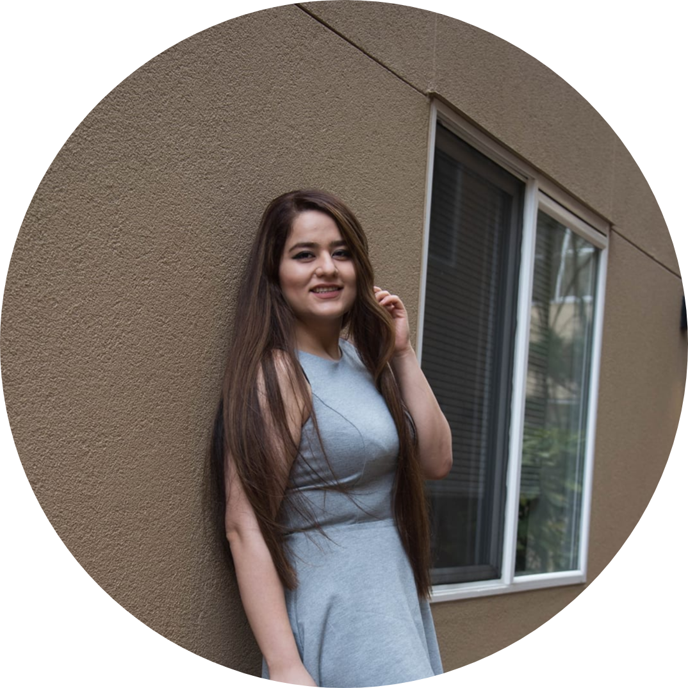

# student-ZahraAliAghazadeh ( Yalda )

## My Homework and Lab Repository.

## Table of contents
* [Credits](#credits)
* [Status](#status) 
* [License](#license) 
* [Contributers](#contributers)

## Credits

curriculum from [Northeastern University Khoury College of Computer Science](https://www.khoury.northeastern.edu/) - Professor [Anthony Mullen ](https://github.ccs.neu.edu/tmullen)

TA team:
* [Zack Katancik](https://github.ccs.neu.edu/zkatancik)
* [Pedro Cantu](https://github.ccs.neu.edu/pantu16)
* [Emily Chiang](https://github.ccs.neu.edu/chiangp)
* [Vincent Chen](https://github.ccs.neu.edu/weisongchen)
* [Chia-Hui Lin](https://github.ccs.neu.edu/nage82822)

#### Inspiration
Python is one of the main languages used in software development.

## Status
_in Progress_

## License

MIT license 
Copyright © 2020 Zahra Ali Aghazadeh

## Contributors

Feel free to contact me via linkedIn for any feedbacks, questions or collaborations! 

  
Zahra Ali Aghazadeh  ( Yalda )
[LinkedIn](https://www.linkedin.com/in/zahraaliaghazadeh/)

