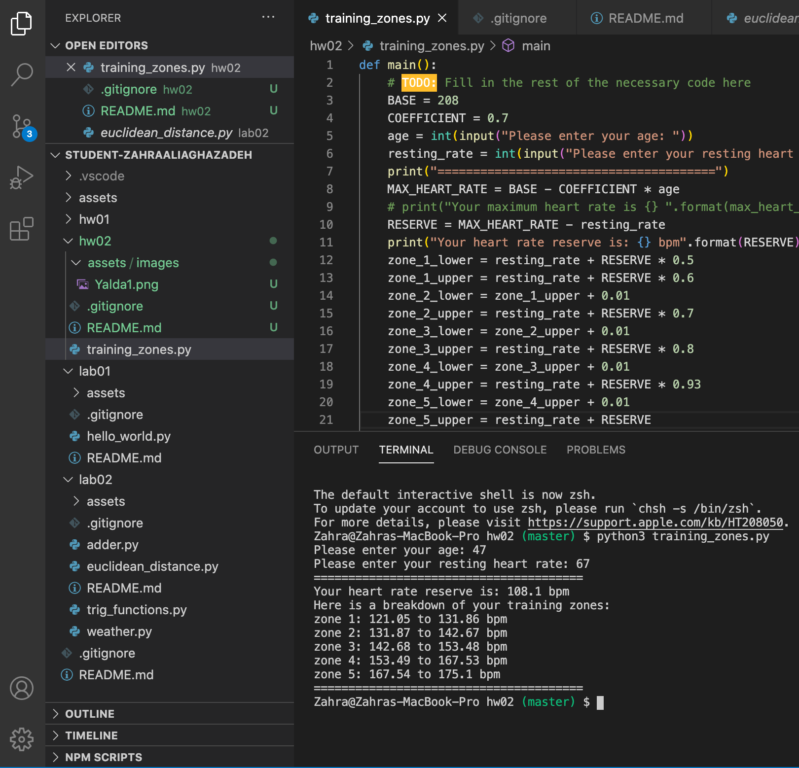

# HW 02

## Training Zones


## Table of contents
* [General info](#general-info) 
* [Screenshots](#screenshots) 
* [Installation](#installation) 
* [Usage](#usage)
* [Credits](#credits)
* [Features](#features) 
* [Status](#status) 
* [License](#license) 
* [Contributers](#contributers)


## General Info

>  This assignment was to use a function definition to calculate different training zones based on the heart rate and age. <br>
max_heart_rate = 208 - 0.7 * age <br>
Zone 1 (from 50% to just under 60%): This zone should feel super easy -- almost like you didn't work out at all. <br>
Zone 2 (from 60% to just under 70%): This is the "average effort" level where it is still possible to hold a conversation. <br>
Zone 3 (from 70% to just under 80%): This is the "above average effort" level where you can only talk in one- or two- word answers. <br>
Zone 4 (from 80% to just under 93%): This is the "hard effort" level. Your breathing is labored, your arms and legs feel heavy, and you can't sustain the pace for much more than an hour (at best). <br>
Zone 5 (from 93% to 100%): This is the "all out" level. You can sustain this pace for a few seconds to maybe five minutes. <br>

For example, suppose you are 20 years old and your resting heart rate is 70 beats per minute. Here are the three steps you would go through to figure out the range of heart rates for zone 2: <br>

Your maximum heart rate is 208-0.7 * 20 = 194 bpm. <br>
Your reserve is 194 - 70 = 124 bpm <br>
At 60%, your heart rate should be 70 + 124 * 0.6 = 144 bpm. At 70%, your heart rate should be 70 + 124 * 0.7 = 156 bpm. <br>
Thus, if you want to work out at zone 2, your heart rate should be between 144 and 156 bpm.<br>


## Screenshots


 

<hr>

## Installation


* [Visual Code](https://code.visualstudio.com/docs/setup/setup-overview)
* [Git](https://git-scm.com/download/)
* [Anaconda](https://www.anaconda.com/products/individual)

To install any of the above , use the link for your device's operating system and then follow the right prompts to install. 

- Since Visual Code is not an option to be downloaded from Anaconda navigator, After installing visual code, you would need to install the extension "Python extension for Visual Studio Code" as well as the extension "Anaconda". 

Then you would download the repository files. Then you would open terminal and type ```python3 filename``` . This will run Python on that file.


#### additional links

[Python Documents](https://docs.python.org/3/library/functions.html)


## Credits

curriculum from [Northeastern University Khoury College of Computer Science](https://www.khoury.northeastern.edu/) - Professor Anthony Mullen


## Features

List of features:

* training_zones.py: prompts the user to enter age and heart rate, and it will print 5 different training zones.


To-do list:

Make the code more polished and efficient.

## Status
Project is:  _finished_

#### Inspiration
Python is one of the main languages used in software development.


## License

MIT license 
Copyright © 2020 Zahra Ali Aghazadeh


## Contributors

Feel free to contact me via linkedIn for any feedbacks, questions or collaborations! 


 <br>
Yalda Ali Aghazadeh 
[LinkedIn](https://www.linkedin.com/in/zahraaliaghazadeh/)


