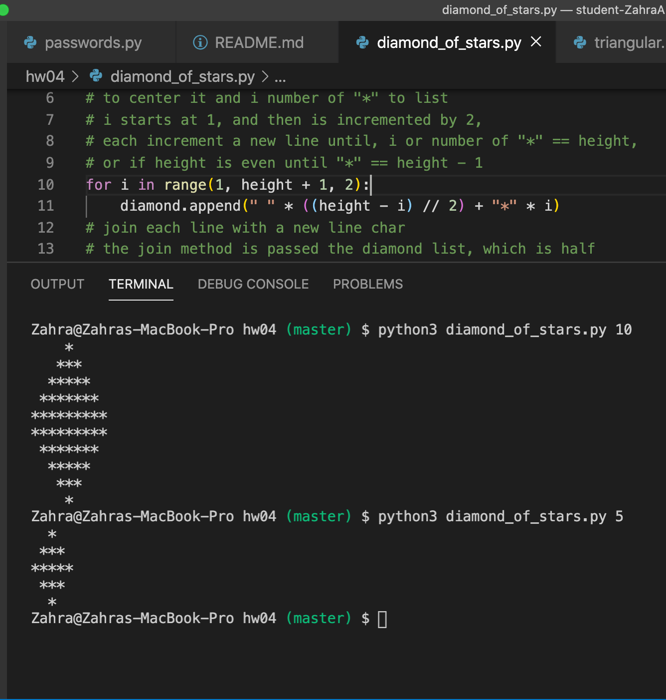
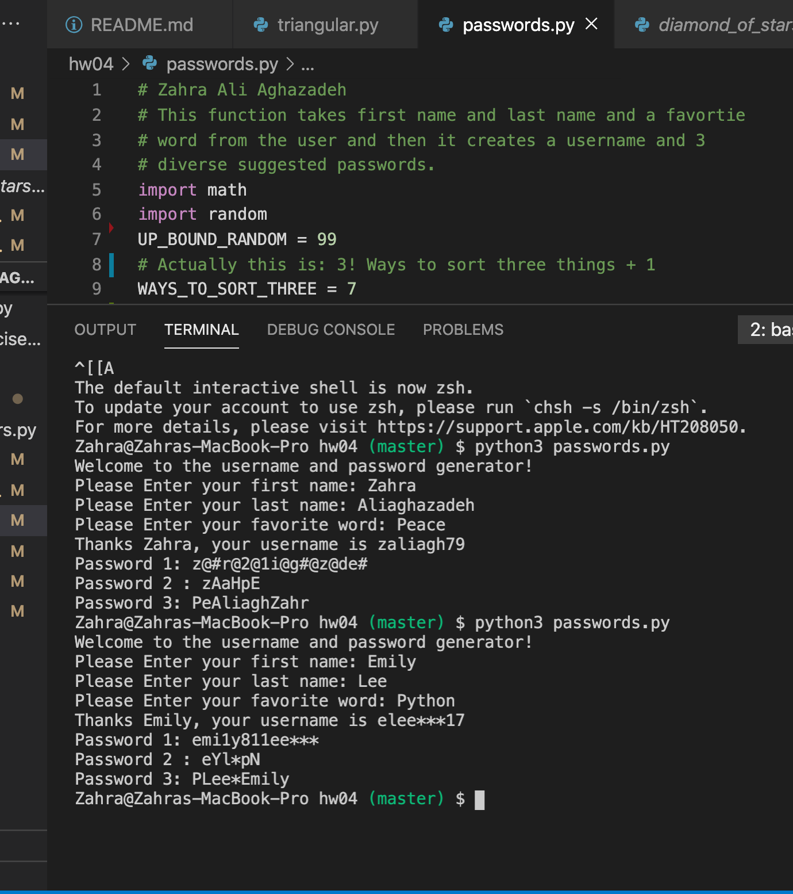
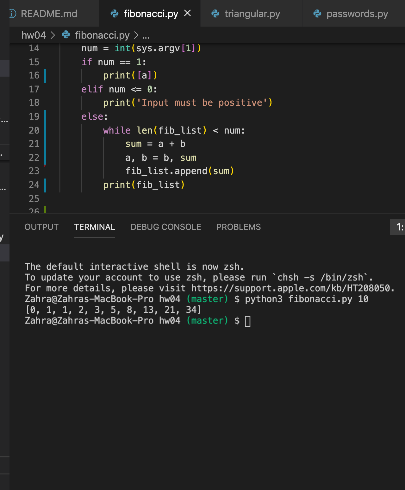
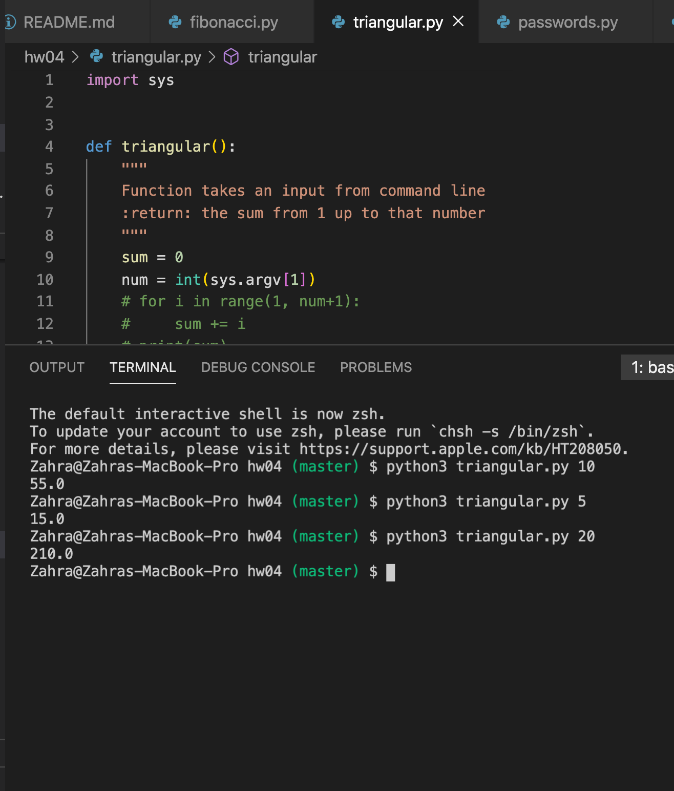

# HW 04

## Diamond, Fibonacci, Password Generator, Triangular


## Table of contents
* [General info](#general-info) 
* [Screenshots](#screenshots) 
* [Installation](#installation) 
* [Usage](#usage)
* [Credits](#credits)
* [Features](#features) 
* [Resources](#resources)
* [Status](#status) 
* [License](#license) 
* [Contributers](#contributers)


## General Info

>  This assignment has Fibonacci sequence, Triangular numbers, Drawing Diamonds and the User Password generator.

## Screenshots


 
 
 
 

<hr>

## Installation


* [Visual Code](https://code.visualstudio.com/docs/setup/setup-overview)
* [Git](https://git-scm.com/download/)


To install any of the above , use the link for your device's operating system and then follow the right prompts to install. 

- Since Visual Code is not an option to be downloaded from Anaconda navigator, After installing visual code, you would need to install the extension "Python extension for Visual Studio Code" as well as the extension "Anaconda". 

Then you would download the repository files. Then you would open terminal and type ```python3 filename``` . This will run Python on that file.

### Specific directions for the user and password:
``` 
The username generated by your program should consist of the first letter from the user's first name, followed by the first seven letters from their last name, and a random integer between 0 and 99. The letters in the username should all be lower case, and you should add * (asterisk) characters as necessary if the last name is shorter than seven characters. (Hint: Add some extra * 's (asterisks) to the last name before you select the seven-character piece, whether you need them or not.) For full credit, your solution must build a single string containing all of these characters and then print it, rather than just printing each piece separately. You should also be polite and personalize the response by including the user's first name, as shown above. 
``` 

```
The first password is the concatenation of the user's first and last names, in lower case, with a random integer in the range 0 – 99 between them. Some of the characters in the resulting string are then replaced by similar-looking digits and punctuation characters. For full credit, you should perform the following replacements, though you can feel free to add some more of your own: All a characters should be replaced by @, o by 0, l by 1, and s by $.
``` 
```
The second password is an "acronym", consisting of the first and last character from the user's first name, the first and last character of their last name, and the first and last letter of their favorite word. In each case, the first letter of the pair should be lower case and the second should be upper case.
``` 
```
The third password takes a random-length portion of the first name, combined with random-length portions of the favorite word and last name (in any order). In each case, those random-length pieces should start at the beginning of the string, and the code should be written such that it's possible to get the entire string if the largest possible random number is produced. At least one character from each part (first name, last name, and favorite word) should appear in the password.
``` 

### Specific Directions for Diamond drawer:
```
This exercise is similar to the triangle example we looked at recently in class (see the code in the slides directory for details). For this exercise, you will write a program called diamond_of_stars.py that draws a diamond out of asterisks, similar to the examples below. You won't hard-code the size of the diamond. Instead, you should write a program that takes an int argument representing the height of the diamond and prints out an appropriately-sized diamond.
```
```
For example, if the program is given the value 5, the resulting diamond will look like this:

  *  
 ***
*****
 ***
  * 
```
```
If the program is given the value 7, the diamond will look like this:

   *   
  ***  
 *****
*******
 *****
  ***  
   *   
```
```
If the value is an even number, the widest line of the diamond should be doubled, as in this case, where the height of the diamond is 6:

  *  
 ***
*****
*****
 ***
  *
```

#### additional links

[Python Documents](https://docs.python.org/3/library/functions.html)


## Credits

curriculum from [Northeastern University Khoury College of Computer Science](https://www.khoury.northeastern.edu/) - Professor Anthony Mullen


## Features

List of features:

* password.py: Takes firstname, lastname and favorite word, and it will generate a username and 3 suggestions for passwords.


* triangular.py: It executes the function and takes the input at the same time in the command line, then it will sum all the numbers up to that number.

* fibonacci.py: It will take the input number from command line, then it will print the list containing the first number-th elements in the list.

* diamont_of_stars: It will ask for an input then it will draw a diamond from stars.

* hw4_book_exercises.txt: This file contains Answers 5.9 Exercises 1 through 5, and 13 from the textbook. (Fundamentals of Python Programming by Richard L. Halterman, 2019)

To-do list:

Make the code more polished and efficient.

## Resources
[PEP 8 Python Style guide](https://www.python.org/dev/peps/pep-0008/#a-foolish-consistency-is-the-hobgoblin-of-little-minds) <br>
[triangular number](https://en.wikipedia.org/wiki/Triangular_number) <br>
[Documentation on argv](https://docs.python.org/3.0/library/sys.html) <br>
[Fibonacci Sequence](https://en.wikipedia.org/wiki/Fibonacci_number) <br>
and Textbook: Fundamentals of Python Programming by Richard L. Halterman, 2019

## Status
Project is:  _finished_

#### Inspiration
Python is one of the main languages used in software development.


## License

MIT license 
Copyright © 2020 Zahra Ali Aghazadeh


## Contributors

Feel free to contact me via linkedIn for any feedbacks, questions or collaborations! 


 <br>
Yalda Ali Aghazadeh 
[LinkedIn](https://www.linkedin.com/in/zahraaliaghazadeh/)
<br>
[NU-Github](https://github.ccs.neu.edu/zahraaghazadeh)
<br>
[Regular-Github](https://github.com/zahraaliaghazadeh/)


