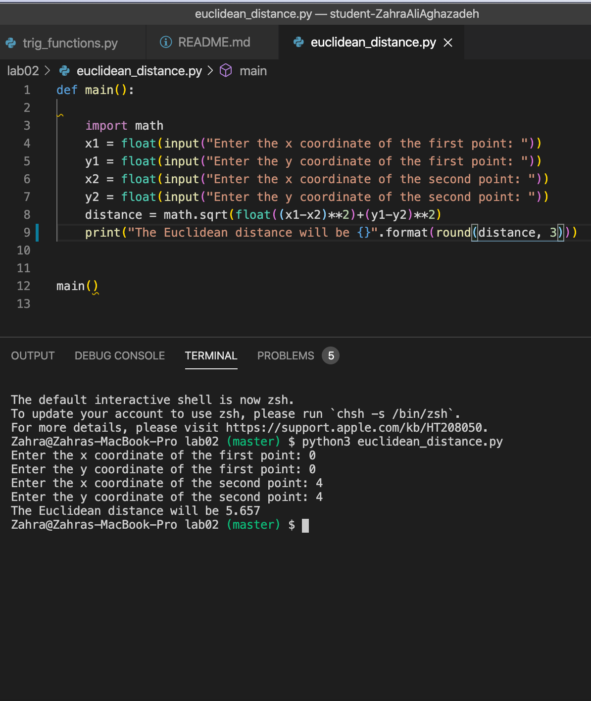
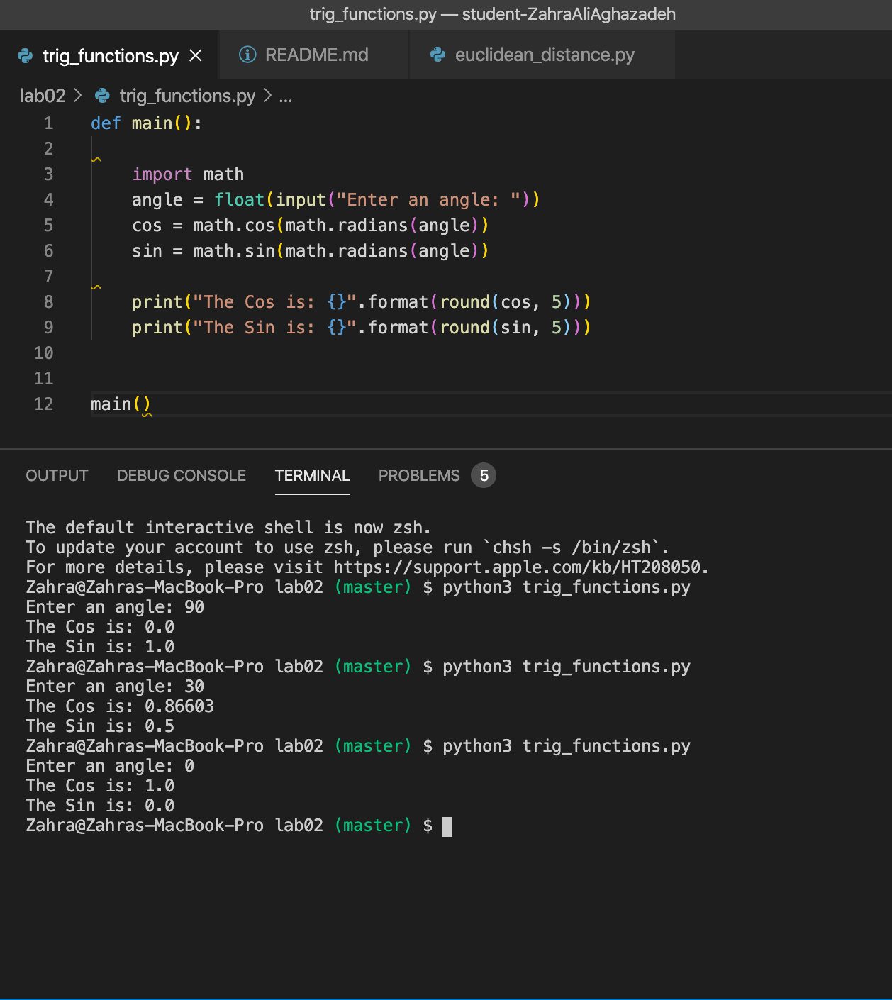

# Lab 02

## Function definition and a few Math operations


## Table of contents
* [General info](#general-info) 
* [Screenshots](#screenshots) 
* [Installation](#installation) 
* [Usage](#usage)
* [Credits](#credits)
* [Features](#features) 
* [Status](#status) 
* [License](#license) 
* [Contributers](#contributers)


## General Info

>  This assignment was to apply math operations on data from weather, add numbers using a function, find the euclidean distance between two points and finally use trig functions to find sin and cos.


## Screenshots


 

<hr>

## Installation


* [Visual Code](https://code.visualstudio.com/docs/setup/setup-overview)
* [Git](https://git-scm.com/download/)
* [Anaconda](https://www.anaconda.com/products/individual)

To install any of the above , use the link for your device's operating system and then follow the right prompts to install. 

- Since Visual Code is not an option to be downloaded from Anaconda navigator, After installing visual code, you would need to install the extension "Python extension for Visual Studio Code" as well as the extension "Anaconda". 

Then you would download the repository files. Then you would open terminal and type ```python3 filename``` . This will run Python on that file.


#### additional links
[Python Mathematical Functions](https://docs.python.org/3/library/math.html) <br>
[Wikipedia on Euclidean distance](https://en.wikipedia.org/wiki/Pythagorean_theorem#Euclidean_distance) <br>
[Wikipedia on Trigonometric functions](https://en.wikipedia.org/wiki/Trigonometric_functions) <br>
[Python Documents](https://docs.python.org/3/library/functions.html)


## Credits

curriculum from [Northeastern University Khoury College of Computer Science](https://www.khoury.northeastern.edu/) - Professor Anthony Mullen


## Features

List of features:

* weather.py:prints the difference between highest and lowest temp in 10 day forecast, calculates the average temperature at noon of the 10 day and also calculates the highest temperature in Celcius. 

* adder.py:is taking two numbers , converting them into floats and printing the sum. It also uses the function defenition to do the same job.

* euclidean_distance.py: prompts the user to enter the x and y coordinates of the two points and then calculates the euclidean distance between the two points rounded to 3 digits.

* trig_functions.py: is taking an input, converting it to radian and then calculating the sin and cos of that angle. rounded to 5 digits.


To-do list:

Can use a for loop to calculate the sum or average in weather.py 

## Status
Project is:  _finished_

#### Inspiration
Python is one of the main languages used in software development.


## License

MIT license 
Copyright © 2020 Zahra Ali Aghazadeh


## Contributors

Feel free to contact me via linkedIn for any feedbacks, questions or collaborations! 


 <br>
Yalda Ali Aghazadeh 
[LinkedIn](https://www.linkedin.com/in/zahraaliaghazadeh/)


