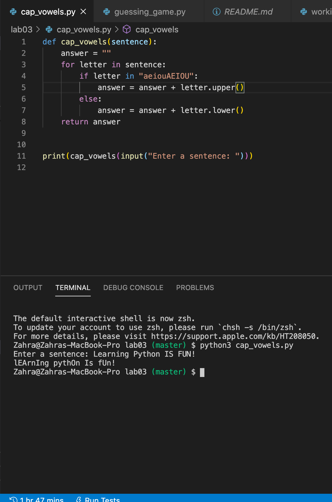
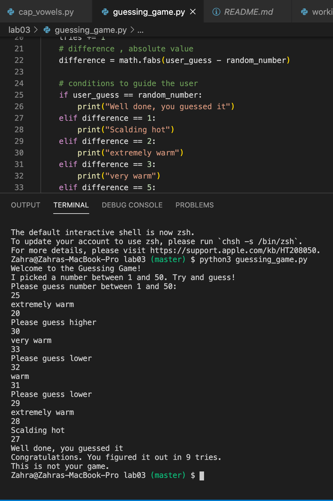
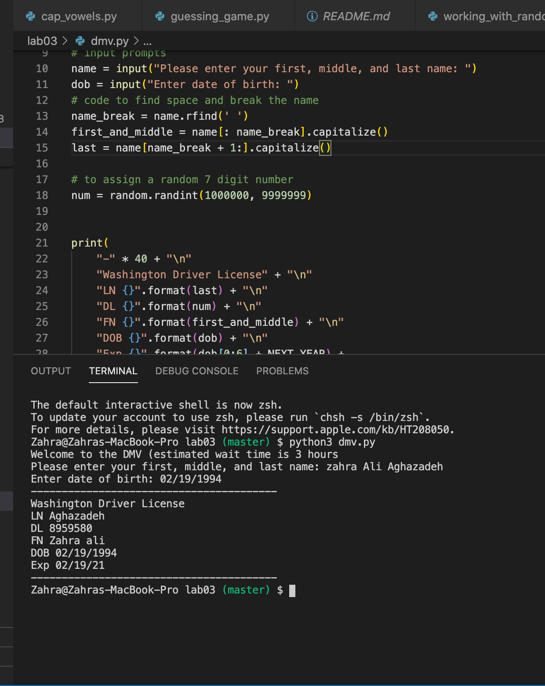

# Lab 03

## This lab was a practice on capitalization, creating a dmv license with your name and finally a guessing game


## Table of contents
* [General info](#general-info) 
* [Screenshots](#screenshots) 
* [Installation](#installation) 
* [Usage](#usage)
* [Credits](#credits)
* [Features](#features) 
* [Status](#status) 
* [License](#license) 
* [Contributers](#contributers)


## General Info

>  This lab was a practice on capitalization, creating a dmv license with your name and finally a guessing game


## Screenshots


  

<hr>

## Installation


* [Visual Code](https://code.visualstudio.com/docs/setup/setup-overview)
* [Git](https://git-scm.com/download/)


To install any of the above , use the link for your device's operating system and then follow the right prompts to install. 

- Since Visual Code is not an option to be downloaded from Anaconda navigator, After installing visual code, you would need to install the extension "Python extension for Visual Studio Code" as well as the extension "Anaconda". 

Then you would download the repository files. Then you would open terminal and type ```python3 filename``` . This will run Python on that file.


#### additional links

[Python Documents](https://docs.python.org/3/library/functions.html)


## Credits

curriculum from [Northeastern University Khoury College of Computer Science](https://www.khoury.northeastern.edu/) - Professor Anthony Mullen


## Features

List of features:

* cap_vowels.py: It will take a string, make the vowels uppercase and the constants lowercase.

* dmv.py: It will prompt for full name and DOB and display a drivers license.

* guessing_game.py: The computer will guess a game, and you keep entering numbers until you get the right number.


To-do list:
polish the code.
 

## Status
Project is:  _finished_

#### Inspiration
Python is one of the main languages used in software development.


## License

MIT license 
Copyright © 2020 Zahra Ali Aghazadeh


## Contributors

Feel free to contact me via linkedIn for any feedbacks, questions or collaborations! 


 <br>
Yalda Ali Aghazadeh 
[LinkedIn](https://www.linkedin.com/in/zahraaliaghazadeh/)


